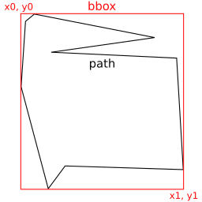

# svg-path-bbox

[](https://www.npmjs.com/package/svg-path-bbox) [](https://travis-ci.com/github/mondeja/svg-path-bbox) [](https://coveralls.io/github/mondeja/svg-path-bbox?branch=master) [](https://github.com/mondeja/svg-path-bbox/blob/master/LICENSE) [](https://www.npmjs.com/package/svg-path-bbox)

SVG paths bounding box calculator.

## Installation

```
npm install svg-path-bbox
```

## Quickstart

```javascript
> const { svgPathBbox } = require("svg-path-bbox")
> svgPathBbox("M5 10l2 3z")
[ 5, 10, 7, 13 ]
> svgPathBbox("M5 10c3 0 3 3 0 3z")
[ 5, 10, 7.25, 13 ]
```

Returned bounding box is an array made up like `viewBox` SVG attributes `[x0, y0, x1, y1]`:

<p align="center">
  
</p>

### Command line

```bash
$ svg-path-bbox "M5 10c3 0 3 3 0 3z"
5 10 7.25 13

$ svg-path-bbox "M5 10c3 0 3 3 0 3z" "M2 8m5 5z"
5 10 7.25 13
2 8 7 13
```

## Documentation

### Bounding box functions [▼](https://github.com/mondeja/svg-path-bbox#bounding-box-functions)
- [svgPathBbox](https://github.com/mondeja/svg-path-bbox/blob/master/README.md#svgPathBbox)
- [cubicBezierCurveBbox](https://github.com/mondeja/svg-path-bbox/blob/master/README.md#cubicBezierCurveBbox)
- [quadraticBezierCurveBbox](https://github.com/mondeja/svg-path-bbox/blob/master/README.md#quadraticBezierCurveBbox)
- [ellipticalArcBbox](https://github.com/mondeja/svg-path-bbox/blob/master/README.md#ellipticalArcBbox)

### Utility functions [▼](https://github.com/mondeja/svg-path-bbox#utility-functions)
- [pathNumbers](https://github.com/mondeja/svg-path-bbox/blob/master/README.md#pathNumbers)
- [maxFloatingNumbers](https://github.com/mondeja/svg-path-bbox/blob/master/README.md#maxFloatingNumbers)

________________________________________________________________________________

### Bounding box functions

<a name="svgPathBbox" href="#svgPathBbox">#</a> <b>svgPathBbox</b>(<i>d</i>) ⇒ `array`

Computes the bounding box of SVG path following the [SVG 2 specification](https://www.w3.org/TR/SVG/paths.html).

- **d** (string) SVG path. 

<a name="cubicBezierCurveBbox" href="#cubicBezierCurveBbox">#</a> <b>cubicBezierCurveBbox</b>(<i>p0</i>, <i>p1</i>, <i>p2</i>, <i>p3</i>, <i>accuracy</i>) ⇒ `array`

Approximates the bounding box of a cubic Bézier curve defined as in the [SVG 2 specification](https://www.w3.org/TR/SVG2/paths.html#PathDataCubicBezierCommands).

- **p0** (array) Start point coordinate.
- **p1** (array) First control point coordinate.
- **p2** (array) Second control point coordinate.
- **p3** (array) End point coordinate.

<a name="ellipticalArcBbox" href="#ellipticalArcBbox">#</a> <b>ellipticalArcBbox</b>(<i>p0</i>, <i>rx</i>, <i>ry</i>, <i>xAxisRotation</i>, <i>largeArc</i>, <i>sweep</i>, <i>p1</i>, <i>accuracy</i>) ⇒ `array`

Approximates the bounding box of an elliptical arc defined as in the [SVG 2 specification](https://www.w3.org/TR/SVG2/paths.html#PathDataEllipticalArcCommands).

- **p0** (array) Start point coordinate.
- **rx** (number) X radius of the arc.
- **ry** (number) Y radius of the arc.
- **xAxisRotation** (number) Rotation in X of the arc in degrees.
- **largeArc** (boolean) `large-arc` flag that specifies how the arc is drawn.
- **sweep** (boolean) `sweep` flag that specifies how the arc is drawn.
- **p1** (array) End point coordinate.
- **accuracy** (number) Power of ten for number of epochs used computing the result.

### Utility functions

> The next functions are used internally but are public to the API because can be useful along with this library.

<a name="pathNumbers" href="#pathNumbers">#</a> <b>pathNumbers</b>(<i>d</i>) ⇒ `array`

Extract all the numbers defined inside a SVG path.

- **d** (string) Path string.

<a name="angleBetween" href="#angleBetween">#</a> <b>angleBetween</b>(<i>v0</i>, <i>v1</i>) ⇒ `number`

Computes the angle between two vectors.

- **v0** (array) First vector in comparison.
- **v1** (array) Second vector in comparison.

<a name="maxFloatingNumbers" href="#maxFloatingNumbers">#</a> <b>maxFloatingNumbers</b>(<i>numbers</i>, <i>min</i>, <i>max</i>) ⇒ `number`

Returns the maximum number of floating point numbers from an array of numbers. The result can be limited with `min` and `max` parameters.

- **numbers** (array) Array of numbers.
- **min** (number) - Minimum limit in response.
- **max** (number) - Maximum limit in response.

## Thanks to
- [MadLittleMods/svg-curve-lib](https://github.com/MadLittleMods/svg-curve-lib) for elliptical arc point on line algorithm.
- [adobe-webplatform/Snap.svg](https://github.com/adobe-webplatform/Snap.svg) for cubic Bezier curve bounding box algorithm.
- [simple-icons/simple-icons](https://github.com/simple-icons/simple-icons) for reference dataset.
